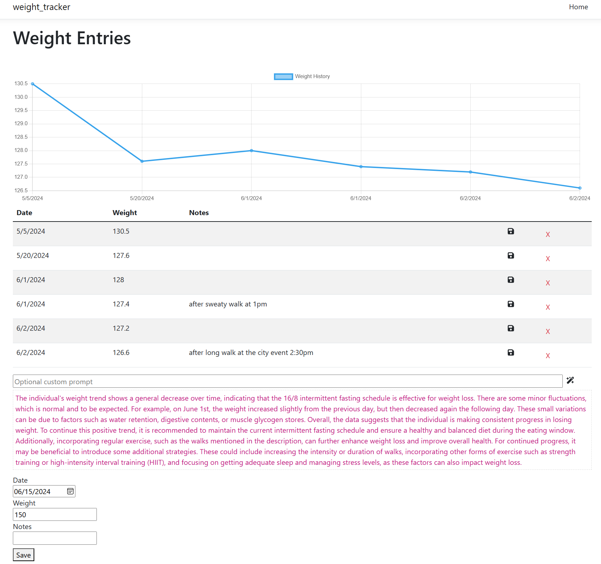

Weight Tracker
==============

An intermittent fasting weight tracking app.

## About

Weight Tracker is a simple web application for entering weight records, including date, weight, and notes.

The app displays a chart of the overall trend in weight change.

The app also provides an AI analysis of the weight trend using a custom prompt specific to an intermittent fasting weight loss regime.

## Screenshot



## Quick Start

Install the required libraries in VSCode before running the project.

1. Open a Terminal in VSCode.
2. `dotnet add package Microsoft.EntityFrameworkCore.Design`
3. `dotnet add package Microsoft.EntityFrameworkCore.Sqlite`
4. `dotnet tool install --global dotnet-ef`
5. Create a file `.env` with the contents:
    ```
    CohereApiKey=<YOUR_API_KEY>
    OpenAIApiKey=<YOUR_API_KEY>
    ````

*You can register a Cohere API key [here](https://dashboard.cohere.com/api-keys).*

*You can register an OpenAI API key [here](https://platform.openai.com/account/api-keys).*

### Customizing the Analysis

The smart analysis of the weight trend can be customized through prompt engineering via the textbox provided. Any custom prompt entered is appended onto the standard prompt used by the program when generating an analysis.

Example 1: "Give the analysis in a fairy tale story format to make it more appealing and happy."

Example 2: "Consider that my height is 5'5", female, what recommendations would you make for an ideal weight and what vegan foods can I eat to achieve this goal?"

### Deployment

To build a deployment for hosting on a web server, use the following steps.

1. In Visual Studio Code, run the **Publish** build step. This performs the following steps automatically:
    ```
    cd ClientApp
    npm run build
    cd ..
    dotnet publish -c Release -o ./publish
    ```
2. Copy the database files `*.sqlite` into `/publish`.
3. Copy the `.env` file into `/publish` and add your API key for Cohere.
4. Run the executable `/pubish/weight_tracker.exe`

The web application will begin running on port 5000. The executable is a self-contained web server, similar to a node.js application, and may be deployed to a Windows web server or Microsoft Azure.

## Tech Stack

- Visual Studio Code
- C# .NET 8.0
- MVC
- React.js
- EntityFramework
- Sqlite
- LLM Cohere and OpenAI

## License

MIT

## Author

Kory Becker http://www.primaryobjects.com/kory-becker
